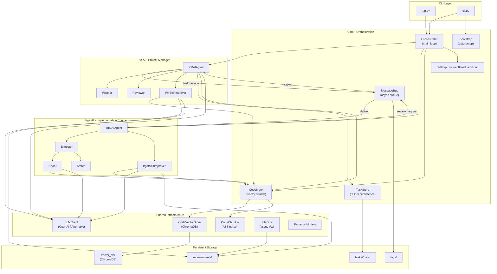
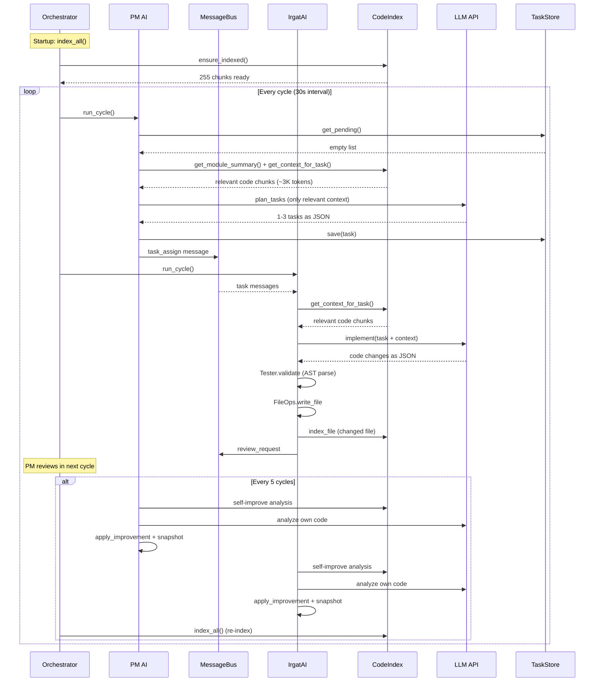
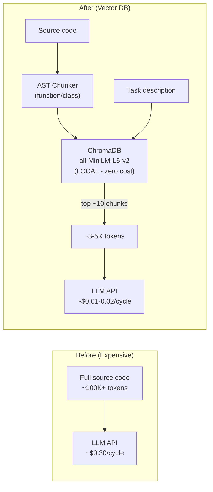

# SkyProject

> **PM AI plans. IrgatAI builds. Both evolve. Continuously.**

SkyProject is a self-evolving AI development system. Drop it into any project and it will analyze, plan, implement, review, and improve — autonomously and continuously.

Two AI agents work as a team:

- **PM AI** — analyzes codebases, creates tasks, prioritizes work, reviews code
- **IrgatAI** — writes production-quality code, executes tasks, builds features

Both agents continuously improve their own source code, creating an ever-accelerating feedback loop.

## Key Features

- **Drop-in deployment** — `skyproject init` auto-detects your project's language, framework, and structure
- **Vector DB powered** — ChromaDB with local embeddings (`all-MiniLM-L6-v2`) for cost-efficient context retrieval. No API calls for embeddings.
- **~80-90% cost reduction** — only relevant code chunks are sent to the LLM, not entire files
- **Self-evolving** — both AI agents analyze and upgrade their own code every N cycles
- **Safety first** — snapshots before every modification, review gates, syntax validation, retry limits
- **Multi-provider** — supports OpenAI and Anthropic (Claude)
- **Language agnostic detection** — auto-detects Python, JavaScript, TypeScript, Go, Rust, Java projects

## Architecture



## Quick Start

### Option 1: From source

```bash
git clone https://github.com/brkylmzco/skyproject.git
cd skyproject

python3 -m venv venv
source venv/bin/activate
pip install -e .

# Configure
cp .env.example .env
# Edit .env — set your API key

# Initialize & index
skyproject init

# Start evolving
skyproject run
```

### Option 2: Docker

```bash
git clone https://github.com/brkylmzco/skyproject.git
cd skyproject

cp .env.example .env
# Edit .env — set your API key

docker compose up
```

### Option 3: Target another project

```bash
# Point SkyProject at your project
skyproject init /path/to/your/project

# It will auto-detect language, framework, structure
# Then start developing it
skyproject run
```

## Usage

```bash
# Initialize (auto-detect, install deps, index codebase)
skyproject init

# Run continuous evolution loop
skyproject run

# Run exactly 5 cycles
skyproject run --cycles 5

# Custom interval between cycles
skyproject run --interval 60

# Disable self-improvement (for testing)
skyproject run --no-self-improve

# Check system status
skyproject status
```

## Configuration

Environment variables (`.env`):

| Variable | Default | Description |
|---|---|---|
| `LLM_PROVIDER` | `openai` | LLM provider (`openai` or `anthropic`) |
| `LLM_MODEL` | `gpt-4o` | Model to use |
| `OPENAI_API_KEY` | — | OpenAI API key |
| `ANTHROPIC_API_KEY` | — | Anthropic API key (if using anthropic) |
| `SKY_AUTO_IMPROVE` | `true` | Enable self-improvement |
| `SKY_CYCLE_INTERVAL` | `30` | Seconds between cycles |
| `SKY_LOG_LEVEL` | `INFO` | Logging level |
| `SKY_VECTOR_MAX_RESULTS` | `10` | Max vector search results per query |
| `SKY_VECTOR_CONTEXT_TOKENS` | `3000` | Max tokens for context retrieval |
| `SKY_TARGET_PROJECT` | — | Path to target project (optional) |

## Project Structure

```
SkyProject/
├── run.py                    # Legacy entry point
├── pyproject.toml            # pip installable package
├── requirements.txt          # Dependencies
├── Dockerfile                # Docker image
├── docker-compose.yml        # Docker Compose
├── Makefile                  # Shortcuts (make run, make init)
├── LICENSE                   # MIT
├── .env.example              # Configuration template
├── .gitignore
│
├── skyproject/
│   ├── __init__.py           # v0.2.0
│   ├── cli.py                # skyproject init/run/status CLI
│   │
│   ├── core/                          # Orchestration layer
│   │   ├── orchestrator.py            # Main evolution loop (155 lines)
│   │   ├── config.py                  # Central config (64 lines)
│   │   ├── bootstrap.py               # Auto-setup + project detection (276 lines)
│   │   ├── communication.py           # Async MessageBus (188 lines)
│   │   ├── task_store.py              # File-based task persistence (94 lines)
│   │   ├── code_index.py              # Vector DB index manager (93 lines)
│   │   ├── self_improvement.py        # Feedback loop (73 lines)
│   │   ├── improvement_tracker.py     # Improvement tracking (62 lines)
│   │   ├── feedback_analysis.py       # Sentiment + trend analysis (180 lines)
│   │   └── ml_insights.py            # KMeans, PCA, anomaly (143 lines)
│   │
│   ├── pm_ai/                         # Project Manager AI
│   │   ├── pm_agent.py               # PM unified agent (213 lines)
│   │   ├── planner.py                # Task planning (60 lines)
│   │   ├── reviewer.py               # Code review engine (67 lines)
│   │   ├── prioritizer.py            # Task prioritization
│   │   ├── self_improve.py           # PM self-improvement (126 lines)
│   │   ├── task_dependency_visualizer.py  # Dependency graph (191 lines)
│   │   ├── ml_insights.py            # ML insights for PM
│   │   └── common.py                 # Error codes
│   │
│   ├── irgat_ai/                      # Implementation Engine AI
│   │   ├── irgat_agent.py            # IrgatAI unified agent (125 lines)
│   │   ├── coder.py                  # Code generation engine (125 lines)
│   │   ├── executor.py               # Task execution coordinator (96 lines)
│   │   ├── tester.py                 # AST validation (55 lines)
│   │   ├── self_improve.py           # Irgat self-improvement (142 lines)
│   │   ├── anomaly_detector.py       # Anomaly detection (50 lines)
│   │   └── exceptions.py             # Custom exceptions (42 lines)
│   │
│   └── shared/                        # Shared infrastructure
│       ├── models.py                  # Pydantic data models (126 lines)
│       ├── llm_client.py             # OpenAI/Anthropic client (198 lines)
│       ├── vector_store.py           # ChromaDB vector store (261 lines)
│       ├── code_chunker.py           # AST-based chunker (155 lines)
│       ├── file_ops.py               # Async file operations (130 lines)
│       ├── prompt_generation.py      # Dynamic prompt generation (128 lines)
│       ├── logging_utils.py          # Logging utilities (55 lines)
│       ├── notifications.py          # FCM notifications (52 lines)
│       ├── api.py                    # FastAPI endpoints (31 lines)
│       └── device_registration.py    # Device registration (70 lines)
│
├── data/                              # Runtime data (gitignored)
│   ├── tasks/                         # Task JSON files
│   ├── logs/                          # skyproject.log + messages.jsonl
│   ├── improvements/                  # Pre-modification snapshots
│   └── vector_db/                     # ChromaDB persistent storage
│
└── tests/                             # Test suite (~30 files)
```

**Total:** ~36 core files, ~4,500+ lines of code, ~30 test files

## How the Evolution Loop Works



## Data Models

Core data structures defined in `skyproject/shared/models.py`:

| Model | Fields | Purpose |
|---|---|---|
| **Task** | id, title, description, task_type, priority, status, target_module, code_changes, review_notes | Unit of work assigned to IrgatAI |
| **CodeChange** | file_path, old_content, new_content, change_type | A single file modification |
| **ReviewResult** | task_id, approved, feedback, quality_score, suggestions | PM AI's review verdict |
| **ImprovementProposal** | source, target, title, description, rationale, proposed_changes, status | Self-improvement plan |
| **Message** | sender, receiver, msg_type, payload | MessageBus communication unit |
| **SystemState** | total_tasks_completed, total_improvements, uptime, cycle_count | Runtime monitoring |

Message types: `task_assign`, `review_request`, `review_result`, `status_update`, `improvement_proposal`

## Cost Optimization

SkyProject uses a **vector DB** (ChromaDB) with **local embeddings** to minimize LLM API costs:



| Approach | Tokens per cycle | Cost estimate |
|---|---|---|
| Before (full source) | ~100K+ tokens | ~$0.30/cycle |
| After (vector search) | ~3-5K tokens | ~$0.01-0.02/cycle |

Embeddings run locally via `all-MiniLM-L6-v2` — zero API cost for indexing and retrieval.

## Safety Mechanisms

- **Snapshots** — full module backup before any self-modification
- **Review gate** — all code changes must pass PM AI review
- **Syntax validation** — AST parsing before code application
- **Retry limits** — max 3 retries per failed task
- **Graceful shutdown** — `Ctrl+C` stops after the current cycle
- **Incremental indexing** — only changed files are re-embedded

## License

MIT License — see [LICENSE](LICENSE)
